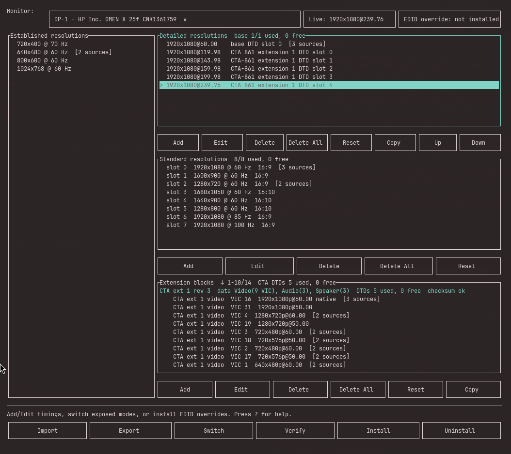

# drmcru

`drmcru` is a Linux DRM/KMS custom resolution utility.

It edits monitor EDID data, exports patched EDID binaries, and can install those
overrides on supported systems so the kernel exposes custom modes after reboot.
Hyprland integration is included for live mode discovery, switching, verification,
and generated legacy `monitor=...` or Hyprland 0.55 Lua monitor rules.

> `drmcru` is an early preview. EDID overrides affect display initialization;
> keep a known-good mode or another way to access the system available.

[](assets/drmcru.png)

## Status

This release has been tested on:

- Hyprland with NVIDIA DRM
- external DisplayPort and internal eDP discovery
- Limine with `limine-mkinitcpio`

Exported EDIDs can be installed manually on other setups. Automatic
Install/Update/Uninstall is currently limited to Limine systems that rebuild with
`limine-mkinitcpio` or mkinitcpio presets.

## Install

Download the portable x86-64 binary from the
[latest release](https://github.com/ssupt/drmcru/releases/tag/v0.1.1):

```sh
curl -LO https://github.com/ssupt/drmcru/releases/download/v0.1.1/drmcru-0.1.1-x86_64-unknown-linux-musl
chmod +x drmcru-0.1.1-x86_64-unknown-linux-musl
./drmcru-0.1.1-x86_64-unknown-linux-musl doctor
./drmcru-0.1.1-x86_64-unknown-linux-musl
```

The TUI and manual Export work on Linux systems that expose connectors through
`/sys/class/drm`. Hyprland is optional, but `hyprctl` is required for live mode
discovery, switching, and verification.

Automatic Install/Update/Uninstall currently requires `pkexec`, Limine,
mkinitcpio, and either `limine-mkinitcpio` or mkinitcpio presets.

## Build From Source

Rust 1.87 or newer is required.

```sh
git clone https://github.com/ssupt/drmcru.git
cd drmcru
cargo build --release
./target/release/drmcru doctor
./target/release/drmcru
```

Useful commands:

```sh
cargo run
cargo run -- doctor
cargo run -- --help
cargo run -- --version
```

## Basic Workflow

1. Select a monitor.
2. Add, edit, copy, or paste a Detailed Resolution.
3. Export the patched EDID, or Install/Update it on a supported system.
4. Reboot.
5. Run `drmcru doctor`.
6. If Hyprland exposes the mode, use Switch or persist the generated
   `monitor=...` rule in your Hyprland config.

`Switch` only selects modes already exposed by DRM/Hyprland. It does not make a
new EDID mode appear.

## What It Can Edit

- Established timing inspection
- Base-block detailed timing descriptors
- Base-block standard timings
- CTA-861 extension detailed timing descriptors

DisplayID Type I detailed timings are decoded and can be copied into an
editable EDID DTD. DisplayID blocks themselves are currently read-only.

Detailed timings are the right place for custom modes such as `1280x1080@240`.
EDID standard timings have fixed aspect-ratio limits and are not suitable for
arbitrary shapes.

## Apply Model

Wayland compositors do not work like X11 modeline injection. For reliable custom
modes, the kernel must see the mode in the connector EDID.

`drmcru` writes EDID overrides for use with:

```text
drm.edid_firmware=DP-1:edid/drmcru_custom_DP-1.bin
```

On the supported Limine/mkinitcpio path, Install/Update modifies:

- `/lib/firmware/edid/<name>.bin`
- `/etc/mkinitcpio.conf`
- `/boot/limine.conf`
- `/etc/limine-entry-tool.d/drmcru-edid.conf` when `limine-mkinitcpio` is used

It writes collision-resistant `.drmcru.*.bak` backups before editing config and
firmware files. Existing overrides for other connectors are retained in the same
kernel parameter. If an install or rebuild step fails, the script restores all
files changed by that run.

## Recovery

If a custom mode is unusable but the desktop remains accessible, switch back
to a known-good mode, choose Uninstall in `drmcru`, and reboot.

If the graphical session is unusable, boot once without the
`drm.edid_firmware=...` parameter using the Limine entry editor or another boot
entry. Then run `drmcru`, choose Uninstall, and reboot. Automatic changes to
`mkinitcpio.conf` and `limine.conf` have timestamped backups beside the original
files.

## Hyprland

When `hyprctl` is available, `drmcru` can:

- merge DRM connector data with `hyprctl monitors -j`
- list Hyprland's exposed modes
- switch to an already exposed mode
- verify the active mode
- inspect simple legacy `monitor=` rules and sourced config files
- inspect literal Hyprland 0.55 `hl.monitor({...})` calls and `dofile(...)` includes

Generated persistent rules follow the detected config format: `hyprland.lua`
takes precedence when present, otherwise `hyprland.conf` syntax is used. Runtime
switching first tries the legacy keyword command and falls back to a Lua
`hl.monitor({...})` evaluation on Hyprland 0.55.

`drmcru` does not auto-edit Hyprland config.

## License

GPL-3.0-or-later. See [LICENSE](LICENSE).
